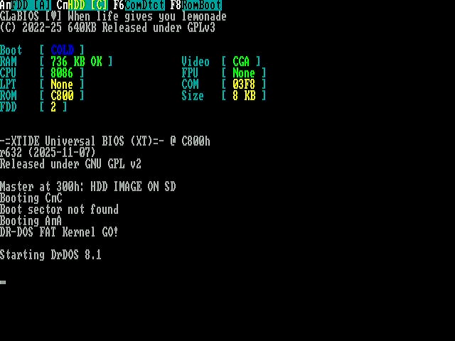
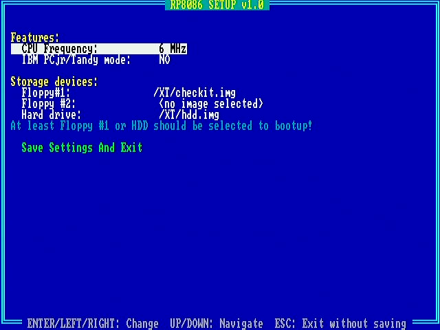
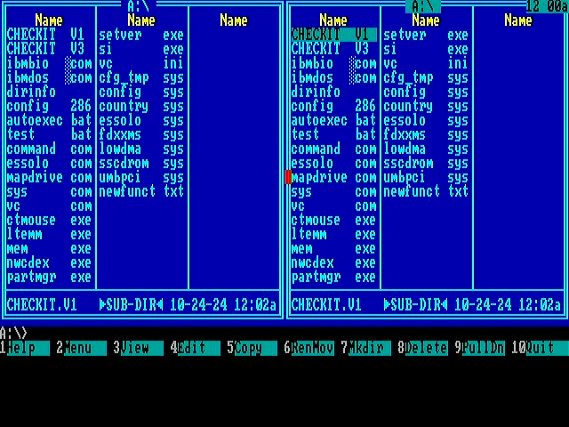

# frank-xt8086

Firmware for the **xt8086 beta** board: an RP2350B acting as the entire
chipset — memory, video, timer, interrupt controller, DMA, floppy, IDE,
serial — for a real Intel 8086 sitting next to it on the same PCB.

The 8086 is not emulated. It fetches, it drives ALE and RD and WR, and a
PIO state machine on the RP2350B answers every bus cycle within a wait
state. Everything the CPU thinks it is talking to is software.



Ported from the [RP8086](https://github.com/rh1tech/RP8086) prototype,
which ran the same idea on a WeAct RP2350B module wired to a breadboarded
8086. The logic is that firmware's; the structure, the pin map, the
toolchain and the console are this board's.

## Quick start

```sh
make hooks          # once, per clone
./build.sh          # build
./swd_flash.sh      # flash through the Debug Probe on J6
./capture.sh view   # watch the board's HDMI output
```

## What it provides the 8086

| Part | Model | Notes |
|------|-------|-------|
| RAM | 736 KB | in the external QSPI PSRAM |
| Video | CGA / Tandy | MC6845 CRTC, 64 colours out of a 6-bit ladder |
| PIC | 8259A | |
| PIT | 8253 | |
| DMA | 8237A | |
| FDC | 8272A | two floppy images off the microSD |
| HDD | XT-IDE | one image off the microSD |
| UART | 16550 | COM1 at 03F8; carries a Microsoft serial mouse |
| BIOS | GLaBIOS | 8 KB at 0xFE000, plus XTIDE Universal BIOS at 0xC8000 |

Disk images are chosen in SETUP and stored on the card; see
`ui/setup_menu.c`.

## Layout

```
boards/     the SDK board header — console and default SPI live here
core/       the bus, the clock, the memory map, the port map, the state
chipset/    the emulated parts: 8237, 8253, 8259, 8272, 16550, XT-IDE
drivers/    video, graphics, microSD, FatFs, USB HID host, PSRAM
ui/         SETUP, the file browser, the serial console
app/        main.c, the linker script, the top-level CMakeLists
roms/       the BIOS images welded into the binary
docs/       the pin map, and the datasheets the models were written from
```

`core/` and `chipset/` are separated on one line: a chip model is only the
behaviour, and the bytes it acts on live together in `core/state.h`. The
port decoder in `core/ports.h` dispatches to all of them from one switch,
which is why it needs them all in one place.

Most of `core/` is header-only, and deliberately. `memory.h` and `ports.h`
are on the read and write path of every bus cycle and have to inline into
the two PIO interrupt handlers in `cpu_bus.c`; a library boundary between
them would be a function call per cycle at six megahertz.

## Building

```sh
./build.sh
```

`app/CMakeLists.txt` is the top of the build — `cmake -S app -B app/build`
if you would rather drive it directly. Options, all settable as
environment variables to `build.sh`:

| Variable | Default | What it does |
|----------|---------|--------------|
| `CPU_SPEED` | `504` | System clock, MHz. **See below.** |
| `PSRAM_SPEED` | `166` | Ceiling for the QSPI PSRAM clock, MHz |
| `SERIAL_CONSOLE` | `OFF` | Mirror the text screen over UART0, accept keys |
| `BUS_TRACE_PIN` | unset | GPIO that goes low on an unmapped access |
| `BEEPER_SWEEP` | `OFF` | Boot sweep for finding a buzzer's resonance |
| `CLEAN` | `0` | Delete the build tree first |

### CPU_SPEED is load-bearing

504 MHz is not an overclock for show. **At 252 MHz this firmware does not
run the 8086 at all**: SETUP draws, autoboot fires, and the screen goes
black. Halting the target there shows PIO0 SM0 with both `TXSTALL` and
`RXSTALL` set and its RX FIFO backed up — the Arm side is not servicing
bus cycles fast enough, and the CPU never gets past its first fetches.
504 MHz boots GLaBIOS, XTIDE and DR-DOS reliably.

This is measured on this board, twice each way. If the bus handlers get
faster, retest before assuming a lower clock is available — a 252 MHz
build needs no `vreg_set_voltage(VREG_VOLTAGE_1_65)` and would be a real
gain in margin and heat.

## The bench toolset

Three things plug into the board, and there is a script for each.

### SWD — flashing and debugging

A Raspberry Pi Debug Probe on **J6** (pin 1 SWDIO, pin 2 GND, pin 3
SWCLK). This is the preferred path and the default:

```sh
./swd_flash.sh                  # program, verify, reset, run
./swd_flash.sh --reset-only     # just restart what is already there
./debug.sh                      # build, flash, break at main, run under GDB
./debug.sh openocd              # server only
```

SWD does not care what the target is doing, so a firmware that has faulted
into lockup still takes a new image without anyone touching the board.
`./flash.sh` is the USB-BOOTSEL fallback for when no probe is attached.

Note that the image is `copy_to_ram`, which confuses software breakpoints
set before the copy runs — `monitor reset halt; load; break main` in that
order, as `debug.sh` does it, rather than breaking on a reset vector.

### UART — the console

stdio is **UART0 on J1** at 115200 8N1: pin 1 TX, pin 2 GND, pin 3 RX.

```sh
./console.sh                    # picocom or screen on the probe's CDC port
./console.sh /dev/cu.usbmodem1234 115200
```

The Debug Probe carries a UART alongside CMSIS-DAP and enumerates it as a
CDC port, so one cable does both jobs — probe UART TX to J1 pin 3, probe
UART RX to J1 pin 1, grounds common.

This is the single biggest thing the new board changes. On the prototype
the console needed the USB controller as a CDC device and a USB keyboard
needed it as a host, so every build was one or the other; here J1 is a
real UART and both are live at once. `SERIAL_CONSOLE=ON` additionally
mirrors the 80x25 text screen over that line and injects what you type as
XT scancodes, which is how to drive the machine with no keyboard attached.

### HDMI capture — seeing the screen from a script

The VGA ladder feeds an MS9288A (U16) which drives J12; a MACROSILICON
MS21xx USB capture stick on the far end of that cable enumerates as
`USB Video` and gives **640x480 at 30 fps** in UYVY — enough to read an
80x25 text screen.

```sh
./capture.sh                    # one frame to out/screen.png
./capture.sh shot out/foo.png
./capture.sh clip 10 out/b.mp4  # ten seconds
./capture.sh view               # live preview
./capture.sh modes              # what the stick will give you
```

This makes "did it boot" a question a script can answer. The screenshots
in this README came out of it.

## Console and video, as booted

| | |
|---|---|
|  |  |
| SETUP, which auto-boots after four seconds | DR-DOS 8.1 off the microSD |

SETUP auto-boots unconditionally. The prototype only did that in its
serial-console build, which meant a release image on a board with no
keyboard sat on the menu for ever.

## Toolchain

- Pico SDK 2.2.0 with the TinyUSB submodule checked out. `sdk_env.sh`
  finds it — an exported `PICO_SDK_PATH` wins only if it actually
  contains an SDK, because a stale export onto an unmounted volume is a
  confusing way to fail.
- Arm GNU Toolchain 14.x (`arm-none-eabi-gcc`)
- CMake 3.13+
- OpenOCD with `cmsis-dap` and `target/rp2350.cfg`
- `picotool` for the USB path, `ffmpeg` for capture, `picocom` or `screen`
  for the console

## Known rough edges

Carried over from the prototype and not yet addressed:

- **167 compiler warnings.** Two are worth fixing first: `i8259_read()`
  and `i8272_readport()` both reach the end of a non-void function, which
  is undefined behaviour on a path the BIOS can take.
- The chip models have no bounds checks on register indices.
- `settings_s` stores three 256-byte paths and is written to the card as a
  raw struct dump with no checksum.
- Comments and identifiers are a mix of English and Russian.

## Licence

GPL-3.0-or-later. FatFs, the SD card driver and the VGA driver carry their
own notices; see the files.
